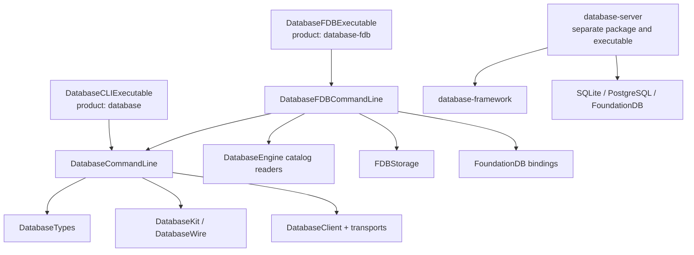
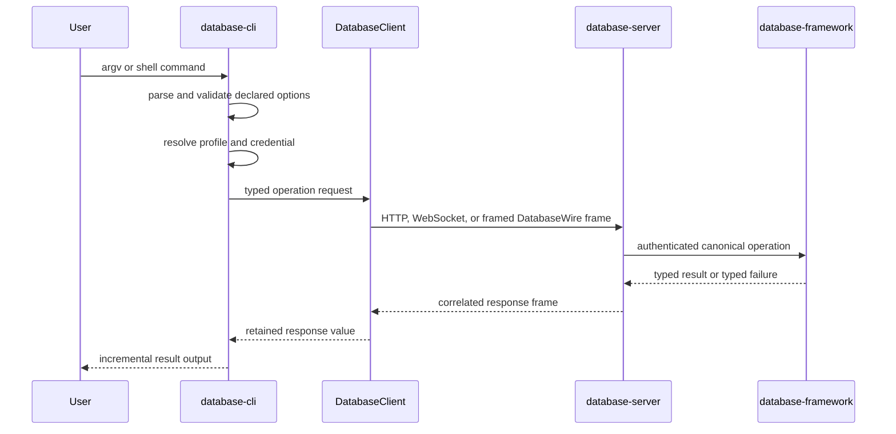

# Architecture

## Scope

`database-cli` owns the user-facing invocation boundary. It parses commands,
resolves profiles and credentials, creates canonical client requests, renders
typed responses, manages shell state, and controls adjacent helper processes.

It does not own database execution, server dispatch, storage construction, or
application schema meaning.

| Responsibility | Semantic owner |
|---|---|
| Primitive values and bounded byte ownership | `database-types` |
| Model, schema, query, index, graph, ontology, SHACL, and DatabaseWire contracts | `database-kit` |
| Request correlation and transport adapters | `database-client` |
| Transactional database execution | `database-framework` |
| Native listener, authentication, routing, dispatch, and server lifecycle | `database-server` |
| Storage transactions and backend adapters | `storage-kit` |
| Commands, profiles, credentials, rendering, shell, and process UX | `database-cli` |

## Package and executable boundaries



The split is a compile-time and link-time boundary:

- `database` links no storage backend and no FoundationDB client library.
- `database-fdb` links FoundationDB only for explicit cluster management and
  bounded read-only diagnostics.
- `database-server` is not a dependency or product of this package. It owns
  native hosting and constructs the selected backend in its own process.

The two adjacent process boundaries are version matched. A missing executable,
version mismatch, invalid response, process failure, or shutdown failure is a
typed failure; the CLI never substitutes an in-process implementation.

## Standard and MultiBase graphs

The default graph is a single-root database:

```text
database command
    -> target-free DatabaseWire v3 operation
        -> database-server dispatch
            -> one DBContainer and one ordinary database root
```

The non-default `MultiBase` trait changes the complete dependency graph rather
than adding nullable target fields to the standard graph:

```text
database command with explicit target
    -> DatabaseWire v5 operation carrying DatabaseOperationTarget
        -> database-server dispatch
            -> database-framework MultiBase execution
                -> Base transaction or read-only Composition plan
```

The ownership of MultiBase concepts remains layered:

| Layer | MultiBase responsibility |
|---|---|
| `database-kit` | Base, Composition, Grant, target, operation, codec, and provenance contracts |
| `database-framework` | Catalog, authorization, placement, transaction, planning, and Composition execution |
| `database-server` | Authentication context, operation dispatch, admission, error mapping, and hosting |
| `database-cli` | Command availability, explicit target selection, request creation, and provenance-preserving rendering |

Composition is therefore not a server-only feature. The server does not define
its semantics, and the CLI does not execute it. The CLI consumes the public
contract owned by `database-kit`; the framework owns the actual read behavior.

When `MultiBase` is disabled, Base, Composition, persisted Grant,
`DatabaseOperationTarget`, their command families, and their rendering paths
are not compiled into the CLI. The standard graph is not implemented as an
implicit Base.

## Remote execution



The URL scheme is the transport selector. The CLI does not retry, choose a
different endpoint, or fall back to another protocol. Trace identifiers,
idempotency keys, execution budgets, paging, graph partitions, preconditions,
and targets retain their canonical operation meaning.

## Adjacent server process adapters

Types whose names contain `DatabaseServer` are active client-side process
adapters, not an embedded copy of the server:

| Type | CLI-owned responsibility | Explicitly absent responsibility |
|---|---|---|
| `DatabaseServerInstallation` | Locate the adjacent executable and verify its exact version | Server configuration or runtime construction |
| `DatabaseServerBootstrap` | Exchange bounded bootstrap metadata and acknowledge credential persistence | Credential issuance policy, listener setup, or authentication |
| `DatabaseServerForegroundProcess` | Start, interrupt, await, and reap `database-server serve` | Hosting or request dispatch |
| `LocalDatabaseServerProcessConnection` | Own child pipes and adapt them to framed-stream transport | DatabaseWire execution or storage access |
| `LocalDatabaseSession` | Compose that transport with `RemoteSession` and shut it down | In-process database session semantics |
| `StandaloneStorageSelection` | Validate CLI options and serialize server arguments | Construct or retain a `StorageEngine` |

The standalone flows are:

```text
database open [storage options]
    -> validate CLI selection
        -> locate and version-check adjacent database-server
            -> launch database-server stdio
                -> private framed-stream DatabaseClient transport
                    -> shared shell parser and executor

database serve [storage options] --profile <name>
    -> locate and version-check adjacent database-server
        -> bounded bootstrap exchange
            -> commit profile and Keychain credential
                -> acknowledge credential
                    -> launch and await database-server serve
```

Storage arguments cross the process boundary as validated command arguments.
The server remains authoritative for configuration, backend construction,
runtime composition, authentication, listeners, signals, and storage shutdown.

## FoundationDB diagnostic boundary

`database fdb ...` delegates to `database-fdb` after exact version validation.
The companion owns only:

- an explicitly selected disposable or existing FoundationDB cluster;
- protocol-level readiness and authoritative stop;
- exact control-domain catalog reads;
- bounded raw get and range reads.

It does not serve a database, implement DatabaseWire dispatch, or provide raw
mutation commands. An explicit cluster selection never falls back to the
system default cluster.

## Streaming and ownership

Query rows, RDF quads, graph results, ontology results, SHACL reports, and
maintenance pages use owner-retaining iterators. The CLI encodes one element at
a time and releases one response page before requesting the next. JSON arrays
are framed incrementally rather than materialized as complete arrays.

For Composition results, the value iterator and provenance iterator advance
together. A missing, extra, or unrepresentable provenance value is a failure.
Continuation bytes are detached before their response owner is released.

The framed-stream adapter performs one documented copy at the operating-system
pipe boundary because NIO owns the outbound buffer until the asynchronous write
completes. Pointers and borrowed views do not escape their owner.

## Lifecycle and failure contract

Every remote transport, WebSocket, helper process, local server process, and
FoundationDB engine owner has one authoritative shutdown path. Success, typed
failure, cancellation, SIGINT, EOF, and pipe failure converge on that path.

The shell retains only a complete previous request and its detached
continuation. It never retains a server transaction. Ctrl-C cancels the active
request or clears buffered input; Ctrl-D exits and awaits session shutdown.

Malformed, unsupported, cancelled, conflicting, unauthorized, unavailable, or
resource-limited work is never converted into empty or synthetic success.
