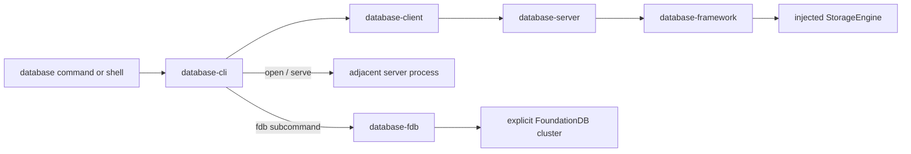

# database-cli

`database-cli` is the authenticated command-line client for DatabaseWire. It
provides one-shot commands, an explicit interactive shell, lossless typed JSON,
bounded pagination, and a separately linked FoundationDB diagnostic companion.

The repository builds two executables:

| Executable | Responsibility |
|---|---|
| `database` | Profiles, credentials, remote invocation, local server process control, rendering, and shell state |
| `database-fdb` | Explicit FoundationDB cluster lifecycle plus bounded, read-only catalog and raw-key diagnostics |

The native `database-server` executable is delivered by the adjacent
[`database-server`](https://github.com/1amageek/database-server) package. The
CLI locates and controls that process for `open` and `serve`; this repository
does not contain or link the server runtime.



## Responsibility boundary

The main executable never imports a storage backend and never performs query,
schema, graph, index, transaction, or authorization execution. It creates
canonical DatabaseWire requests through `DatabaseClient` and renders canonical
responses.

| Concept | Owner |
|---|---|
| Query, schema, index, graph, ontology, SHACL, and Wire models | `database-kit` |
| Client correlation and HTTP, WebSocket, or framed-stream transport | `database-client` |
| In-process database execution, including Composition reads | `database-framework` |
| Native hosting, authentication, routing, and operation dispatch | `database-server` |
| Storage transaction and backend behavior | `storage-kit` |
| CLI parsing, profiles, credentials, rendering, and process UX | `database-cli` |

Composition is not a server-only concept. Its semantic and Wire declarations
belong to `database-kit`, its execution belongs to `database-framework`, and
the server only hosts and dispatches the operation. The CLI only selects a
target, sends the typed request, and preserves result provenance.

See [Architecture](Documentation/Architecture.md) for the complete package,
process, ownership, and lifecycle boundaries.

## Requirements

- macOS 26 or later;
- Swift 6.4 development snapshot `org.swift.64202608141a` for source builds;
- a version-matched `database-server` next to `database` for `open` and
  `serve`;
- an HTTP, HTTPS, WebSocket, or secure WebSocket DatabaseWire endpoint for
  remote commands;
- FoundationDB 7.3 client headers and library only when building or using
  `database-fdb` or a FoundationDB-enabled server.

## Build and install

Build the remote client without linking FoundationDB:

```bash
export TOOLCHAINS=org.swift.64202608141a
swift build \
  --product database \
  --disable-dependency-cache \
  --only-use-versions-from-resolved-file
```

Build the optional FoundationDB companion separately:

```bash
export TOOLCHAINS=org.swift.64202608141a
swift build \
  --product database-fdb \
  --disable-dependency-cache \
  --only-use-versions-from-resolved-file
```

Build `database-server` from its own package. Install each executable used by
the workflow in the same directory. The CLI rejects a missing companion or a
version mismatch.

```bash
database --version
database-server --version
database fdb --version
```

Running `database` without arguments prints help. Interactive mode starts only
with `database shell` or `database open`.

## Quick start

Create a remote profile and store its access token in the macOS Keychain:

```bash
database profile create production \
  --endpoint https://database.example.com/v1/database \
  --database main \
  --tenant acme \
  --workspace research
database profile use production
database auth login
database capabilities
```

`auth login` reads the token from the configured environment source or a
non-echo terminal prompt. Bearer tokens are never accepted as arguments or
stored in profiles.

Run target-free commands against a standard single-root server:

```bash
database query sql 'SELECT * FROM Person' --page-size 100
database query sparql @query.rq --output jsonl
database mutate sparql @update.ru \
  --idempotency-key update-2026-08-20
```

Open a standalone SQLite database through the adjacent server:

```bash
database open --memory
database open ./local.sqlite --schema @schema.json
database serve ./production.sqlite --profile production-local
```

PostgreSQL and FoundationDB are selected explicitly. There is no backend
fallback:

```bash
database open --storage postgresql \
  --postgres-host 127.0.0.1 \
  --postgres-user database \
  --postgres-password-file ~/.config/database/postgres.password \
  --postgres-database database

database open --storage foundationdb \
  --fdb-cluster-file /etc/foundationdb/fdb.cluster \
  --fdb-directory applications \
  --fdb-directory local
```

`open` starts `database-server stdio` over a private framed stream and enters
the shared shell. `serve` prepares a server configuration and runs
`database-server serve` in the foreground. Database execution and backend
construction remain in the server and framework packages.

## Optional MultiBase graph

The default package graph uses target-free DatabaseWire v3 with 14 operation
families and one ordinary database root. It does not compile Base,
Composition, persisted Grant, or `DatabaseOperationTarget` into the CLI.

Enabling the non-default `MultiBase` trait across the dependency graph selects
DatabaseWire v5 with 17 operation families and explicit targets:

| Operation | Required target |
|---|---|
| Database control and catalog | Database/control target selected by command semantics |
| Read-only query | `--base <id>` or `--composition <id>` |
| Mutation, graph, ontology, SHACL, command, or maintenance | `--base <id>` |
| Grant and job control | Database/control target or explicit `--base <id>` |

There is no implicit Base. A Composition is read-only, and Composition results
preserve origin and consistency metadata. Formats that cannot preserve the
required provenance fail explicitly.

```bash
database base create main \
  --placement default \
  --initial-grant role:admin=read,write,administer \
  --expected-revision 0 \
  --idempotency-key create-main

database query sql 'SELECT * FROM Person' --base main
database query sql 'SELECT * FROM Person' --composition shared
```

See [Command contract](Documentation/Commands.md) for the exact target rules
and every available Base, Composition, and Grant command.

## Data and output contracts

- Structured values use lossless tagged JSON; untagged JSON numbers are
  rejected.
- `--page-size` bounds one response page and never rewrites SQL or SPARQL.
- `--all` requires aggregate row, byte, and page bounds.
- Each page is rendered and released before the next page is requested.
- Standard output contains results only; diagnostics and prompts use standard
  error.
- Failed authentication, authorization, decoding, transport, resource, and
  capability checks remain typed failures.

See [Lossless typed JSON](Documentation/TypedJSON.md) and the
[Command contract](Documentation/Commands.md) for the complete input, paging,
format, and exit-code contracts.

## FoundationDB diagnostics

`database fdb ...` delegates to the adjacent `database-fdb` executable. Every
cluster operation uses an explicit cluster file or a deliberately discovered
project-local file. Raw diagnostics are read-only and bounded.

```bash
database fdb cluster init --path /srv/database --port 4690
database fdb cluster start --path /srv/database
database fdb cluster status --path /srv/database
database fdb raw range \
  --cluster-file /srv/database/.database/fdb.cluster \
  --key-utf8 catalog \
  --limit 100 \
  --max-total-bytes 1048576
database fdb cluster stop --path /srv/database
```

Raw write, delete, and clear commands do not exist. An explicit missing or
unreachable cluster is a typed failure and never falls back to the system
default cluster.

## Verification

The package-owned harness selects the pinned toolchain, resolves URL
dependencies, builds once, injects the matching Swift Testing runtime, and
validates the `.xcresult`:

```bash
scripts/xcode-test-harness
DATABASE_CLI_TEST_TRAITS=MultiBase scripts/xcode-test-harness
```

Process and FoundationDB behavior use separate lifecycle-owning harnesses:

```bash
scripts/process-test-harness
scripts/fdb-test-harness
```

See [Testing and release](Documentation/Testing.md) for required test counts,
binary inputs, service isolation, artifacts, teardown, and release checks.

## Documentation

| Document | Scope |
|---|---|
| [Architecture](Documentation/Architecture.md) | Package ownership, process boundaries, data flow, and lifecycle |
| [Command contract](Documentation/Commands.md) | Commands, options, targets, effects, outputs, and failures |
| [Lossless typed JSON](Documentation/TypedJSON.md) | Canonical structured-value representation |
| [Security](Documentation/Security.md) | Credentials, routing, bootstrap, files, and backend identity |
| [Testing and release](Documentation/Testing.md) | Test harnesses, release evidence, and teardown |

## License

See [LICENSE](LICENSE).
