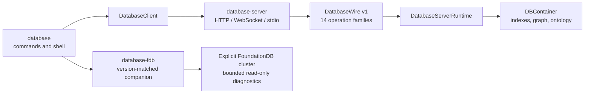

# database-cli

`database-cli` is the authenticated command-line interface for DatabaseWire.
It provides one-shot commands, an explicit interactive shell, lossless typed
input and output, bounded pagination, and a separately linked FoundationDB
diagnostic companion.

Current development version: `26.0809.1`



The main `database` executable never imports or links a storage backend. Remote
commands always pass through the authenticated server runtime. FoundationDB
lifecycle and read-only inspection are isolated in the adjacent
`database-fdb` executable.

## Requirements

- macOS 26 or later;
- the pinned Swift 6.4 development snapshot
  `org.swift.64202607231a` for source builds;
- the version-matched `database-server` executable for `open` and `serve`;
- an HTTP, HTTPS, WebSocket, or secure WebSocket DatabaseWire endpoint for
  remote commands;
- FoundationDB 7.3 client headers and library when building the native server
  or `database-fdb`; `fdbserver` and `fdbcli` only for local cluster lifecycle
  and diagnostics.

## Build and install

Build the remote client without linking FoundationDB:

```bash
export TOOLCHAINS=org.swift.64202607231a
swift build \
  --product database \
  --disable-dependency-cache \
  --only-use-versions-from-resolved-file
```

Build the FoundationDB companion separately:

```bash
export TOOLCHAINS=org.swift.64202607231a
swift build \
  --product database-fdb \
  --disable-dependency-cache \
  --only-use-versions-from-resolved-file
```

Build the native server from the adjacent `database-server` package:

```bash
export TOOLCHAINS=org.swift.64202607231a
swift build --product database-server
```

Install `database`, `database-server`, and `database-fdb` in the same directory.
Both companion boundaries reject a missing executable or a different version.
Use `swift build --show-bin-path` to locate each built product.

Verify the installation before configuring a server:

```bash
database --version
database
database-server --version
database fdb --version
```

Running `database` without arguments prints help. It never enters interactive
mode implicitly.

## Quick start

Open an ephemeral or file-backed standalone database:

```bash
database open --memory
database open ./local.sqlite --schema @schema.json
```

Select another native storage backend explicitly:

```bash
database open --storage postgresql \
  --postgres-host 127.0.0.1 \
  --postgres-user database \
  --postgres-password-file ~/.config/database/postgres.password \
  --postgres-database database

database open --storage foundationdb \
  --fdb-cluster-file /etc/foundationdb/fdb.cluster
```

| `--storage` | Selection contract |
|---|---|
| `sqlite` (default) | One positional file path or `--memory` |
| `postgresql` | Exactly one TCP host or Unix socket, plus role and database |
| `foundationdb` | An explicit cluster file; no default-cluster fallback |

The PostgreSQL password value is never accepted through argv. The optional
password file is opened by the server as an owner-owned mode-`0600` regular
file. `--database` remains the DatabaseWire routing identity; it does not
select a storage backend.

`open` starts the adjacent server over a private framed stream and enters the
shell. The child runtime and storage engine are shut down authoritatively when
the shell exits.

Start a persistent network server and create its local profile:

```bash
database serve ./production.sqlite --profile production
database serve --storage foundationdb \
  --fdb-cluster-file /etc/foundationdb/fdb.cluster \
  --profile production-fdb
```

The first launch creates a mode-`0600` server configuration and token registry,
stores the initial administrator token in the macOS Keychain through a private
acknowledged pipe, and serves `http://127.0.0.1:7878/v1/database`. Later starts
reuse the same profile and credential.

For an existing remote server, create and select a routing profile, then store
its access token in the macOS Keychain:

```bash
database profile create production \
  --endpoint https://database.example.com/v1/database \
  --database main \
  --tenant acme \
  --workspace research
database profile use production
database auth login
database capabilities
```

`database auth login` reads a token from a configured environment variable or
from a non-echo terminal prompt. A bearer token is never accepted as a command
argument.

Run a query and a mutation:

```bash
database query sql 'SELECT * FROM Person' --page-size 100
database query sparql @query.rq --output jsonl
database mutate sparql @update.ru \
  --idempotency-key update-2026-08-08
```

All structured inputs accept inline lossless typed JSON, `@path`, or `@-` for
a bounded standard-input read.

## Command catalog

```text
database
├── profile create|list|show|use|remove
├── auth login|logout
├── capabilities
├── open
├── serve
├── schema list|show|plan|apply
├── query sql|sparql
├── mutate sql|sparql
├── entity insert|update|upsert|delete|apply
├── graph
│   ├── shortest-path
│   ├── weighted-shortest-path
│   ├── page-rank
│   ├── community
│   ├── cycles
│   ├── strongly-connected-components
│   └── topological-sort
├── ontology describe|upsert|delete|reason|hierarchy|validate-schema
├── shacl describe|upsert|delete|validate
├── command run
├── migration status|run
├── index status|rebuild
├── maintenance compact
├── job status|wait|result|cancel
├── inspect overview|entities|indexes|graph|ontology|shapes|jobs
├── doctor
├── completion bash|zsh|fish
├── shell
└── fdb
    ├── cluster init|start|stop|status
    ├── catalog list|show
    └── raw get|range
```

Remote families map directly to canonical DatabaseWire operations. Commands
that support resumable execution accept `--as-job <kind>` only when the server
advertises that exact operation family and job kind. `job wait` performs
deadline-bounded status polling; it is not a separate wire operation.

`schema plan` and `schema apply` use the fourteenth operation,
`schemaExecute`. Apply requires the expected current fingerprint and an
idempotency key. A successful apply publishes one immutable runtime generation;
in-flight requests retain their old generation lease.

`doctor` is strictly read-only. It reports installation/configuration,
credential availability, DNS resolution, TCP connectivity, TLS validation,
authenticated protocol negotiation, and schema readability as separate
`pass`, `warn`, `fail`, or `skipped` checks with remediation text. It never
renders or transmits a credential during the DNS/TCP/TLS-only probes.

See [Command contract](Documentation/Commands.md) for positional arguments,
family mapping, and operation-specific options.

## Connection and authentication

The selected profile is the normal connection source. A command may override
its routing identity for one invocation:

```text
--profile <name>
--endpoint <http[s]://...|ws[s]://...>
--database <id>
--tenant <id>
--workspace <id>
```

The endpoint URL scheme selects HTTP or WebSocket transport. Both transports
send the same database, tenant, and workspace routing headers. The CLI does not
retry automatically, select another endpoint, or silently fall back to a
different transport.

Credential resolution order is:

1. the selected profile's macOS Keychain item;
2. the environment variable named by the profile;
3. `DATABASE_ACCESS_TOKEN`;
4. a non-echo terminal prompt.

Profile files contain routing configuration only. Configuration directories use
mode `0700`; profile and persistent-history files use mode `0600`.

`database serve` never accepts a bearer-token argument. Its private bootstrap
pipe sends a raw initial token only once; the CLI acknowledges it only after the
Keychain and profile update succeed. Rejection removes the new server
credential. Non-loopback listeners are rejected unless the server configuration
has TLS and a complete database/tenant/workspace routing identity.

## Request metadata and execution budgets

`--trace-id` and `--idempotency-key` are copied directly into
`OperationRequestMetadata`. The five `ExecutionBudget` fields are exposed
one-to-one:

| Option | Default |
|---|---:|
| `--maximum-rows` | 10,000 |
| `--maximum-work-units` | 1,000,000 |
| `--maximum-intermediate-rows` | 10,000 |
| `--maximum-intermediate-bytes` | 16 MiB |
| `--timeout-milliseconds` | 30,000 |

Failures are returned to the caller. Budget exhaustion, malformed input,
authentication failure, transport failure, and unsupported capabilities are
never converted into empty success.

## Paging and continuations

The default page size is 1,000 rows and the default invocation fetches one
page. A continuation is emitted as unpadded base64url and can be supplied to a
later invocation:

```bash
database query sql @query.sql --continuation <base64url>
```

Fetching every page requires all three aggregate safety limits:

```bash
database query sql @query.sql --all \
  --max-total-rows 100000 \
  --max-total-bytes 67108864 \
  --max-pages 100
```

`--all` cannot be combined with an initial continuation. Each result page is
rendered and released before the next page is requested; the CLI does not
materialize the complete result set.

## Lossless typed values

Every `FieldValue` case has an explicit `$type`. Untagged JSON numbers are
rejected, so integers, decimals, floating-point bit patterns, bytes, vectors,
references, RDF terms, arrays, and objects preserve their exact identity.

```json
{"$type":"int64","value":"-9223372036854775808"}
```

```json
{"$type":"float64","bits":"3ff0000000000000"}
```

```json
{"$type":"bytes","value":"AAEC_w"}
```

The decoder rejects duplicate keys, unknown tags, non-canonical integers,
out-of-range values, non-finite values, invalid base64url, and configured byte
or nesting-limit violations. See [Lossless typed JSON](Documentation/TypedJSON.md)
for the complete representation contract.

## Output contract

TTY output defaults to `table`; redirected output defaults to lossless `jsonl`.
Use `--output table|jsonl|json|csv|nquads` to fix a format.

| Stream or format | Contract |
|---|---|
| `stdout` | result payloads only |
| `stderr` | diagnostics, timing, prompts, and non-row paging metadata |
| `jsonl` | one lossless typed value per line |
| `json` | incrementally written JSON array |
| `csv` | scalar rows only; other results fail |
| `nquads` | RDF results only; other results fail |

Broken pipes and partial-output failures are reported as failures. Large query,
RDF, graph, ontology, and SHACL result paths consume retained iterators one
element at a time.

## Interactive shell

Start the shell explicitly:

```bash
database shell
```

The shell uses the same command parser and executor as one-shot invocations.
`query sql`, `query sparql`, `mutate sql`, and `mutate sparql` enter multiline
mode when no statement is supplied. A semicolon does not execute a buffer;
use `\g` explicitly.

```text
\help
\profile <name>
\output table|jsonl|json|csv|nquads
\timing on|off
\budget
\page-size <count>
\next
\history
\mode command
\g
\clear
\quit
```

`\next` replays the immediately preceding request with its detached
continuation. The shell does not keep a server-side transaction alive and does
not provide `begin`, `commit`, or `rollback` commands.

History is memory-only by default. `--persist-history` enables a mode-`0600`
history file; authentication commands are never recorded. Ctrl-C cancels the
active request or clears the current input buffer. Ctrl-D exits the shell.

## FoundationDB diagnostics

`database fdb ...` delegates to the adjacent, version-matched `database-fdb`
binary.

```bash
database fdb cluster init --path /srv/database --port 4690
database fdb cluster start --path /srv/database
# Explicitly relax the reserve only for an isolated disposable cluster.
database fdb cluster start --path /tmp/database-test \
  --minimum-available-space-ratio 0.0
database fdb cluster status --path /srv/database
database fdb catalog list \
  --cluster-file /srv/database/.database/fdb.cluster
database fdb raw get \
  --cluster-file /srv/database/.database/fdb.cluster \
  --key-hex 01636174616c6f67 \
  --max-total-bytes 1048576
database fdb raw range \
  --cluster-file /srv/database/.database/fdb.cluster \
  --key-utf8 catalog \
  --limit 100 \
  --max-total-bytes 1048576
database fdb cluster stop --path /srv/database
```

Raw keys require exactly one of `--key-hex`, `--key-utf8`, or `--key-tuple`.
Range reads require both row and total-byte limits. Raw write, delete, and clear
commands do not exist.

An explicit missing or unreachable cluster file is a typed failure. The helper
never falls back to the system default cluster. Readiness requires a real
`fdbcli` protocol probe, and stop completes only after both the process and
protocol endpoint are unreachable.

## Exit codes

| Code | Meaning |
|---:|---|
| `0` | success |
| `2` | input or configuration |
| `3` | authentication |
| `4` | authorization |
| `5` | not found |
| `6` | conflict or constraint |
| `7` | resource limit |
| `8` | transport or unavailable |
| `9` | protocol or internal failure |
| `130` | cancellation |

## Shell completions

Generated completion definitions are included for Bash, Zsh, and Fish:

```text
Completions/database.bash
Completions/_database
Completions/database.fish
```

Install or source the file using the normal completion directory for the
selected shell. A golden test requires every checked-in file to exactly match
the immutable `CommandCatalog` generator, so commands cannot drift from parser
or help definitions.

## Verification

Use the pinned toolchain and strict Xcode harness:

```bash
export TOOLCHAINS=org.swift.64202607231a
scripts/xcode-test-harness
```

The harness resolves URL dependencies without using Xcode's shared repository
cache, builds once, injects the matching Swift Testing runtime, and runs the
generated `.xctestrun` without rebuilding. The reviewed contract is 48 logical
tests, zero failures, zero skips, zero expected failures, zero runtime warnings,
and no internal tool errors.

Process and real FoundationDB integration use the exact binaries from the
URL-resolved build:

```bash
export DATABASE_CLI_EXECUTABLE=/path/to/database
export DATABASE_FDB_EXECUTABLE=/path/to/database-fdb
export DATABASE_SERVER_EXECUTABLE=/path/to/database-server
scripts/process-test-harness
scripts/fdb-test-harness
../database-server/scripts/storage-test-harness
```

The process harness verifies stdout/stderr separation, exit codes, explicit
shell launch, controlling-terminal Tab completion, history permissions, secret
redaction, companion version matching, standalone memory/file operation, child
shutdown, and FoundationDB link separation. It also starts `database serve`,
reaches it through the saved profile and Keychain credential, sends SIGINT, and
requires negative readiness.
The FoundationDB harness provisions an
isolated FoundationDB 7.3 cluster, verifies protocol readiness, exercises
selected-cluster reads, stops the service, and requires negative readiness.

See [Testing and release](Documentation/Testing.md) for artifact and release
requirements.

## Documentation

- [Architecture](Documentation/Architecture.md)
- [Command contract](Documentation/Commands.md)
- [Lossless typed JSON](Documentation/TypedJSON.md)
- [Security](Documentation/Security.md)
- [Testing and release](Documentation/Testing.md)

## License

See [LICENSE](LICENSE).
